|地点|时间|建议|图片|
|-|-|-|-|
|熊猫苑|Day1-am|上午去，熊猫精神更好，门票68r|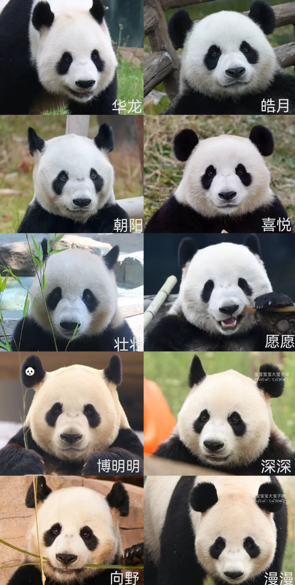|
|花语世界|Day1-am|四季花开不断，离熊猫苑很近。but好像风评不好，要门票30r|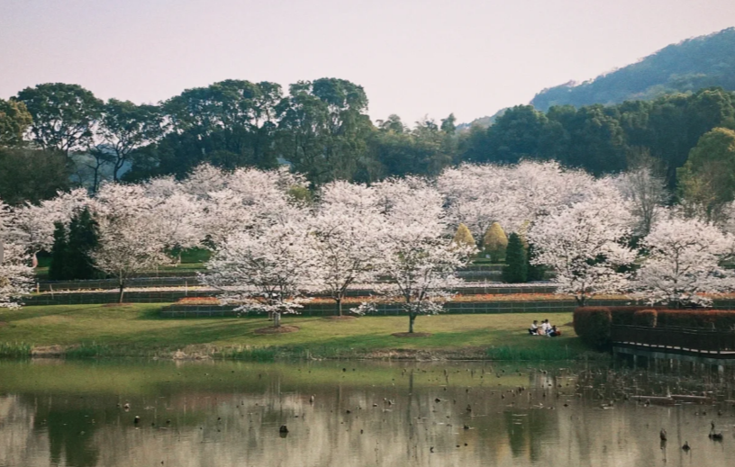|
|洞庭湖小镇|Day1-pm|洞庭湖边上的小公园||
|圣安古寺|Day1-pm|寺庙，可以求签许愿，门票20r|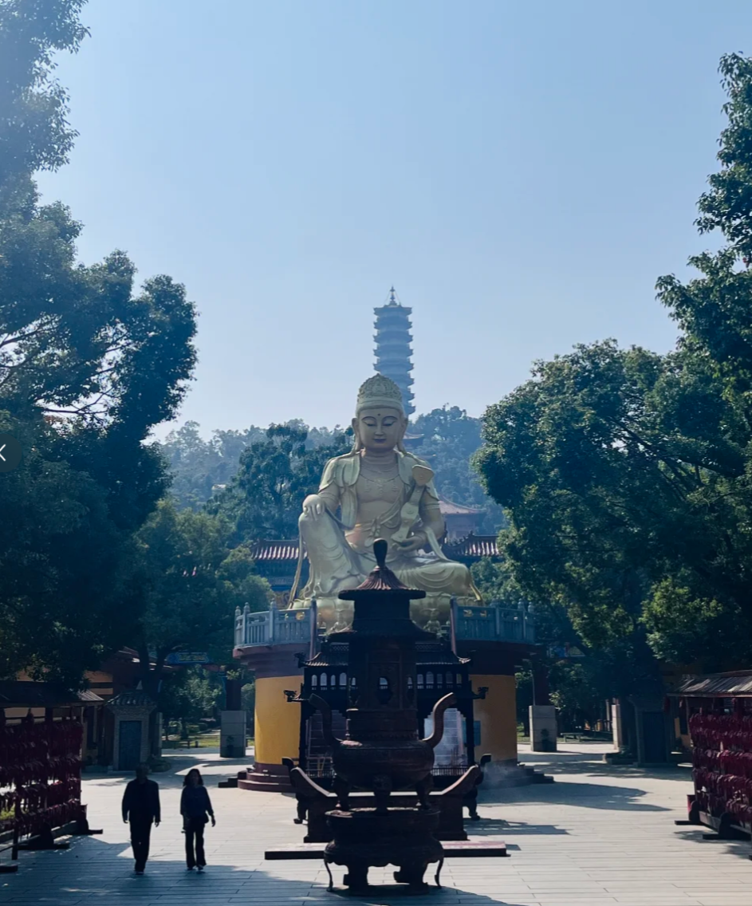|
|教会学院|Day1-pm|很小，民国建筑，老学校||
|飘尾|Day1-pm|日落好看，但是没有很建议|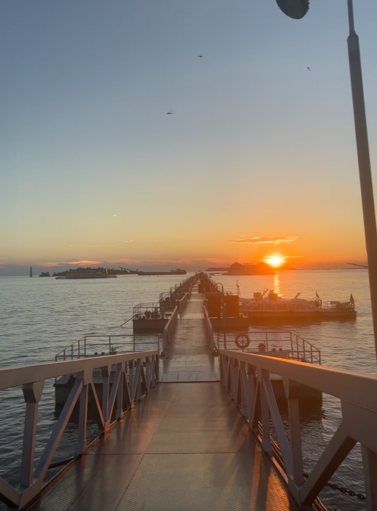|
|岳阳楼|Day2-am|最近景区在翻新，但是主楼还能上。逛完去汴河街|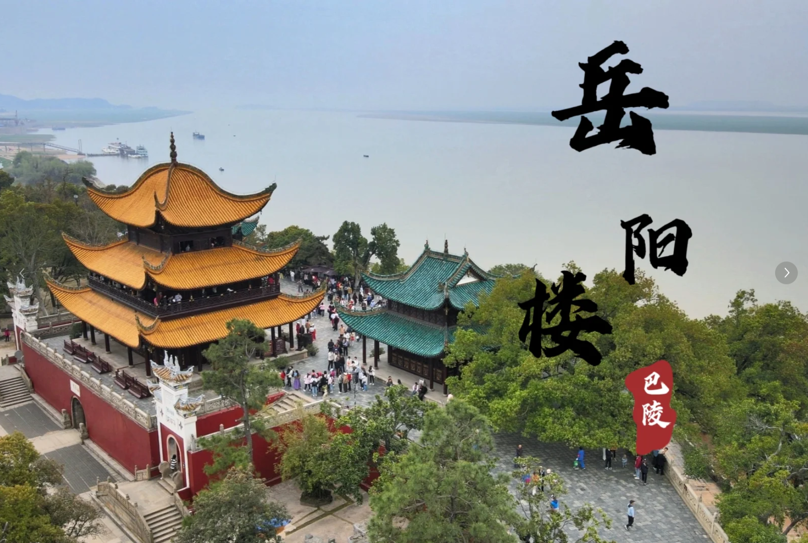|
|巴陵广场|Day2-am逛完岳阳楼来|后裔射巴蛇雕塑||
|洞庭南路|Day2-pm||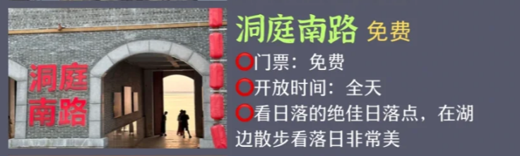|
|南津古渡|Day2-pm|岳阳古渡口，坐小船|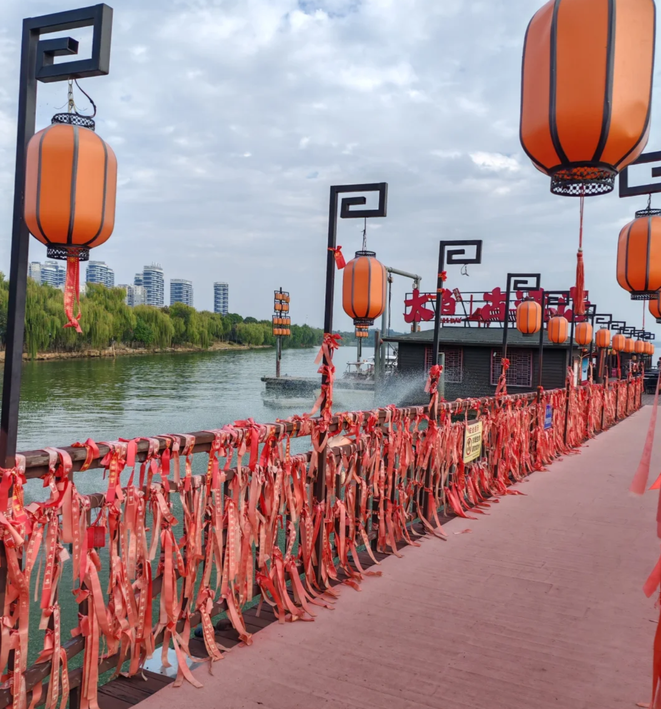|
|金鹗山公园|Day2-pm，或者刚到那天去。|晚六点关门。也有说七八点还开着的有周瑜墓、孔子广场，感觉偏文雅一点|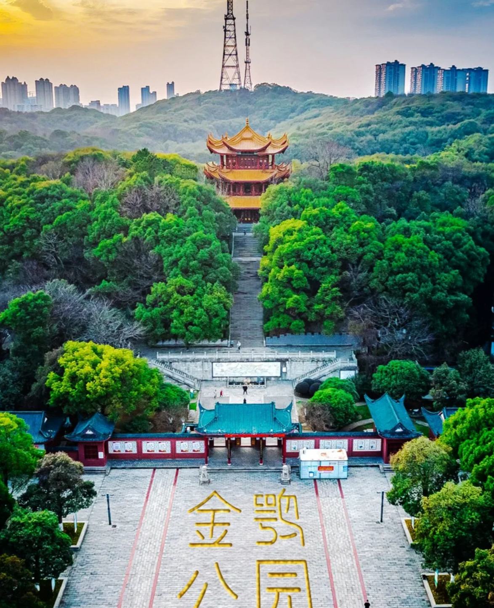|
|南湖公园|Day2-pm|公园，可以慢慢逛，围绕洞庭湖一角，有20km步道，可以骑车|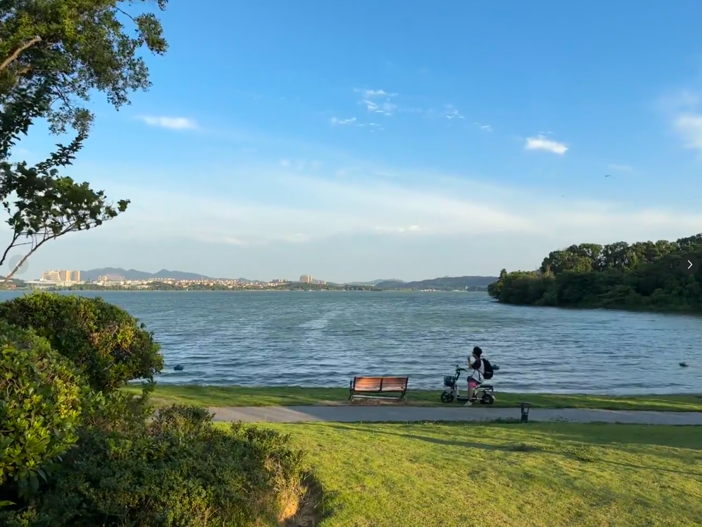|

## 地图

### 第一天
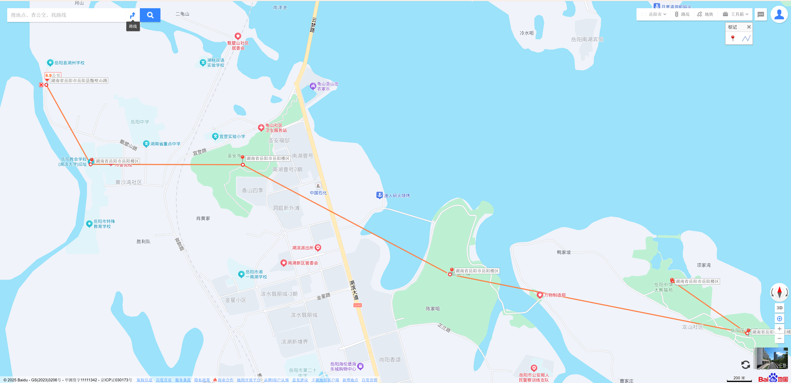

### 第二天
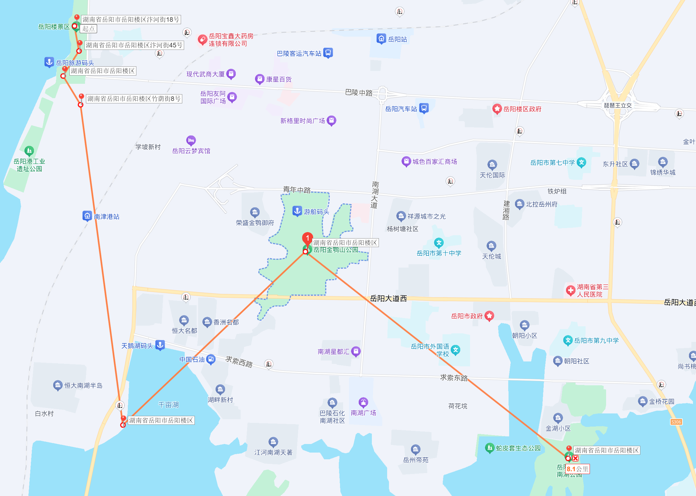

## 门票及开放时间

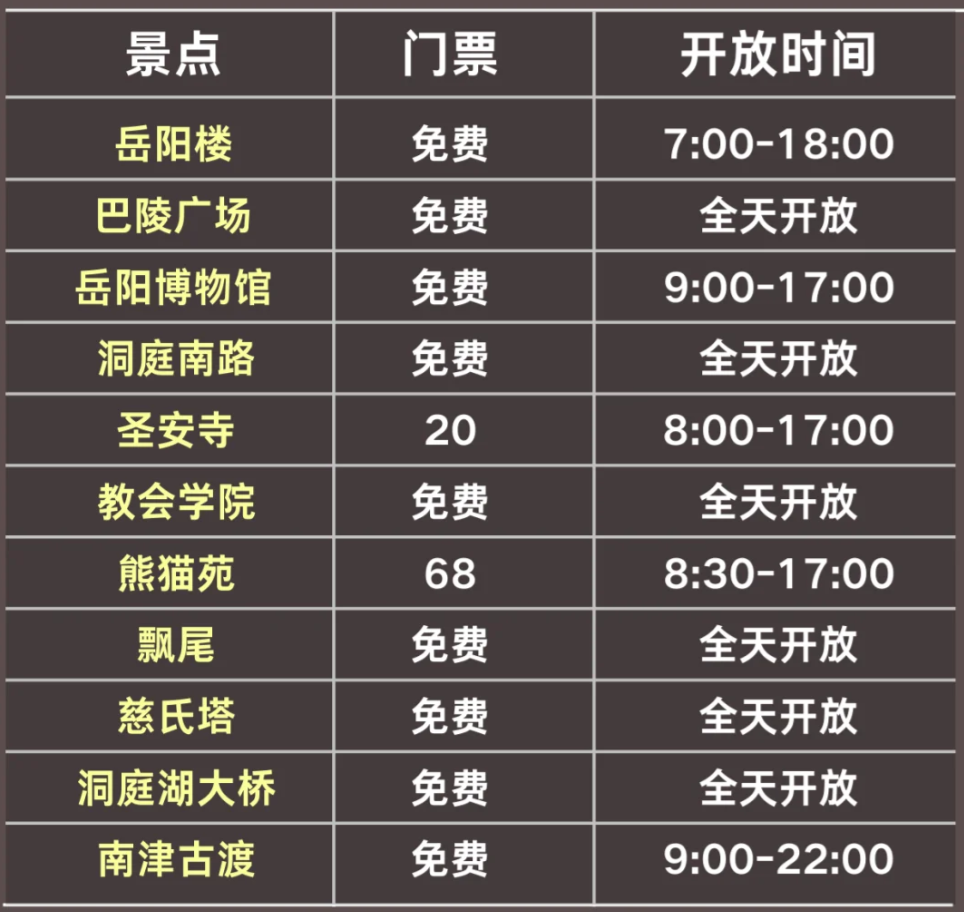