# 恩施
|景点|时间|内容|注意|图片|
|-|-|-|-|-|
|恩施大峡谷|5.17|纯爬山。七星寨必去|要预约|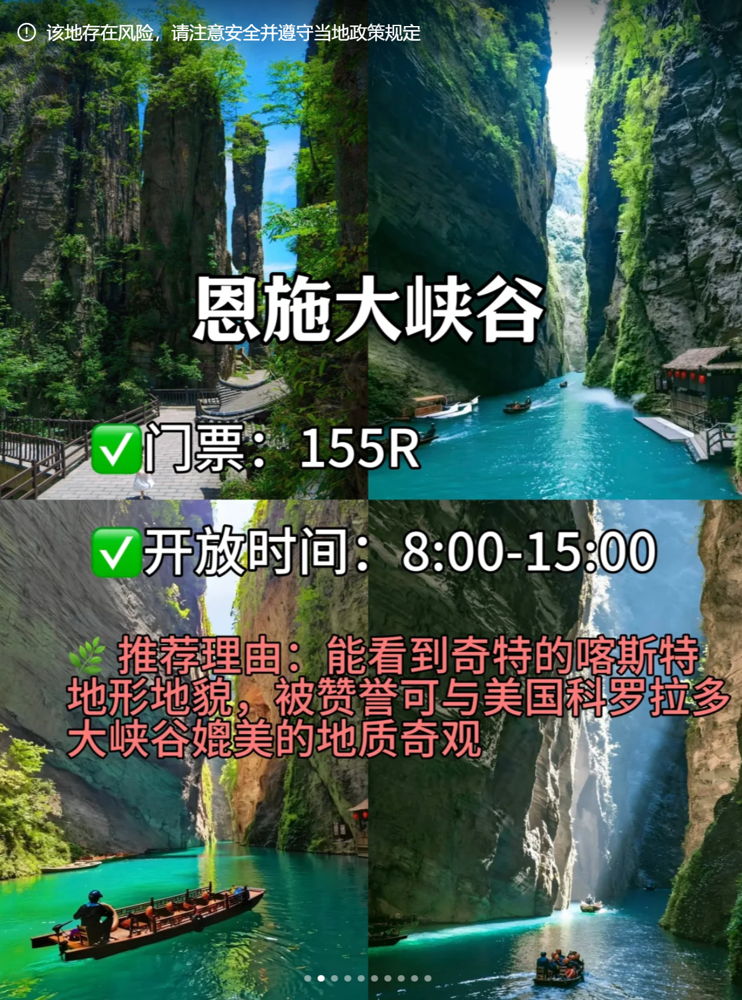|
|鹿院平|5.17|纯爬山。古村落|要预约|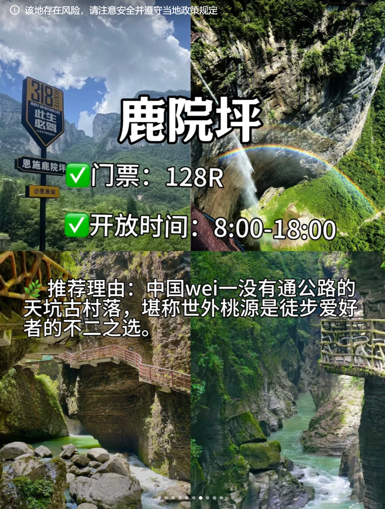|
|腾龙洞|5.17|纯爬山|要预约150r|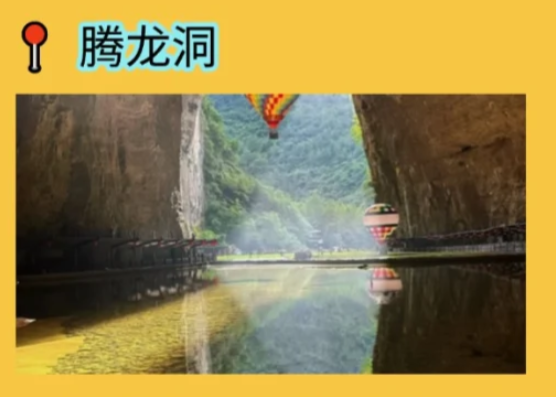|
|土司城|5.16|在市区|45r，学生半价||
|梭布垭石林|5.18|古地质景观||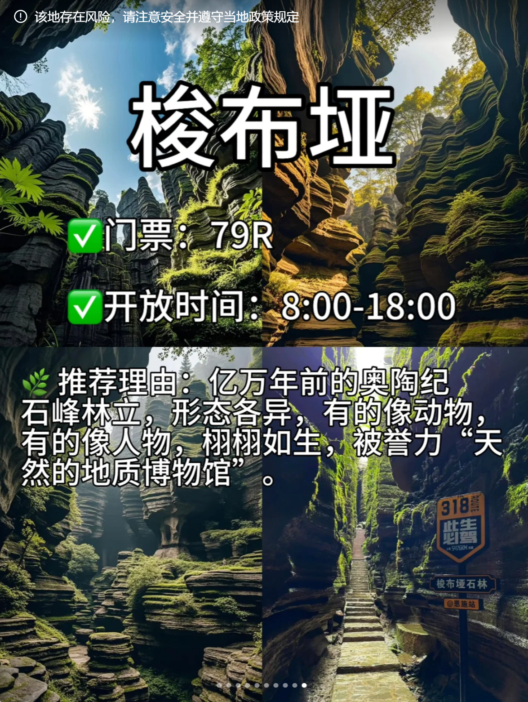|
|女儿城|5.16|市区||
|地心谷||太远了，跟梭布垭石林选一个。去的话也可以坐高铁到高坪||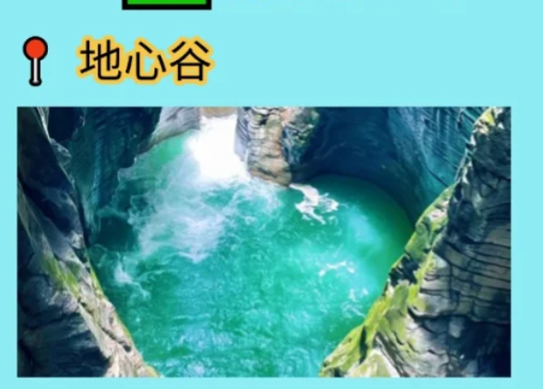|
|龙鳞宫||||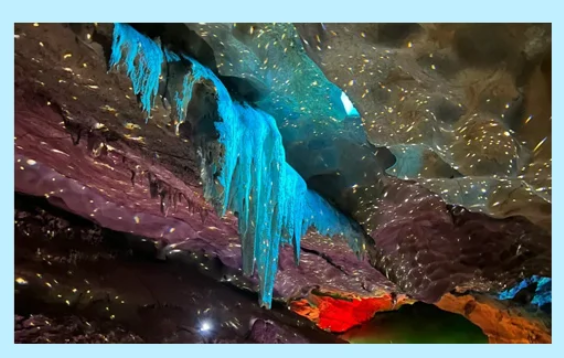|
|恩施大清江|5.18|远离市区的景点。全程在船上，不费腿。注意不是清江大峡谷，后者会下船||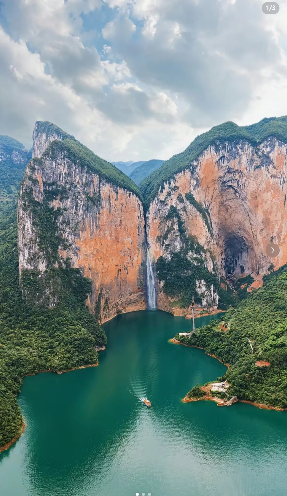|

## 恩施大峡谷

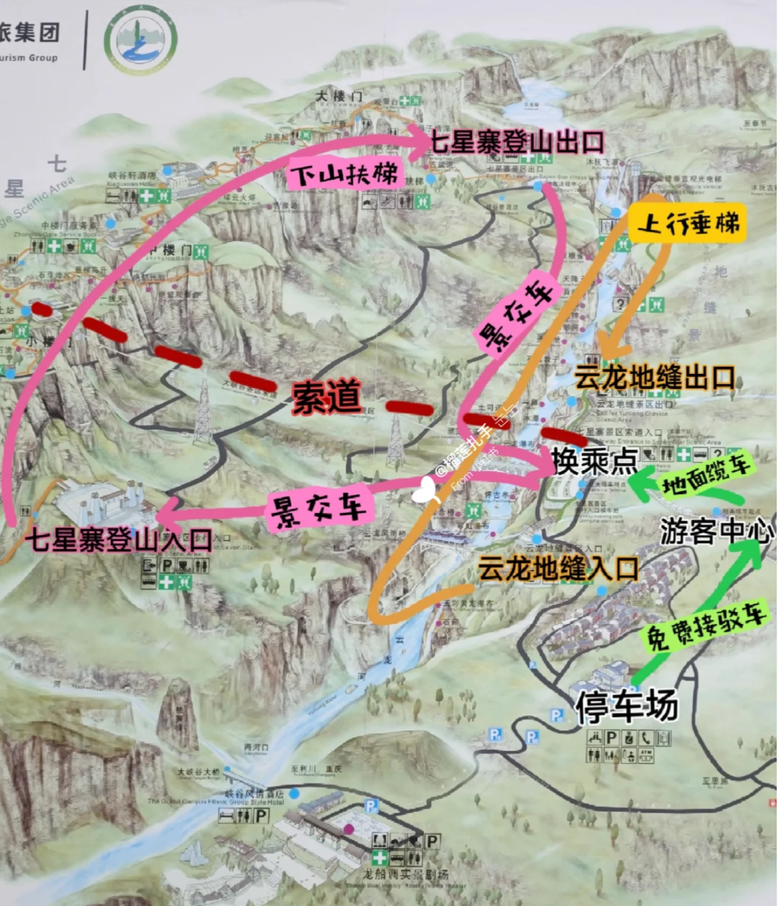
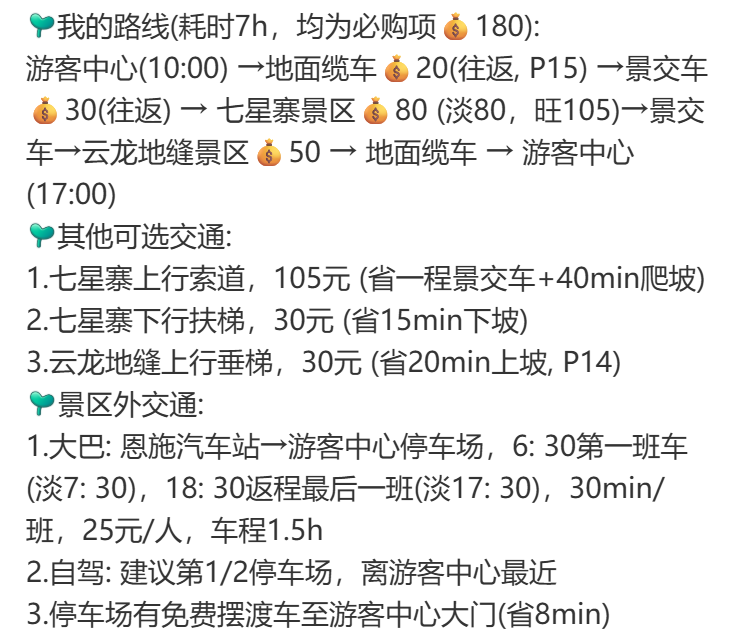

## 大巴时间

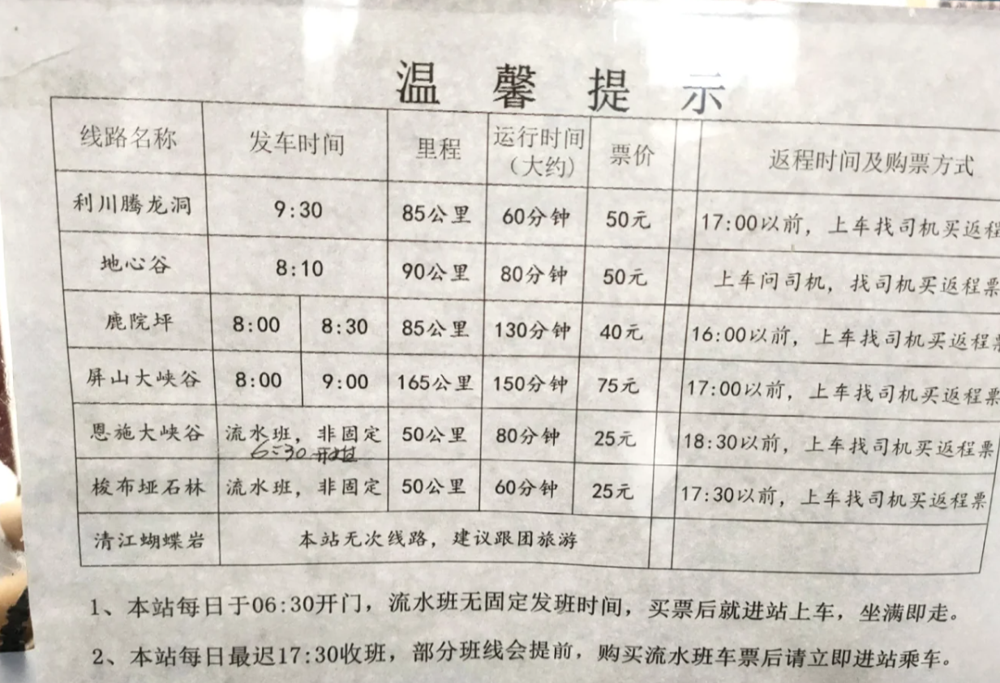

## 地图
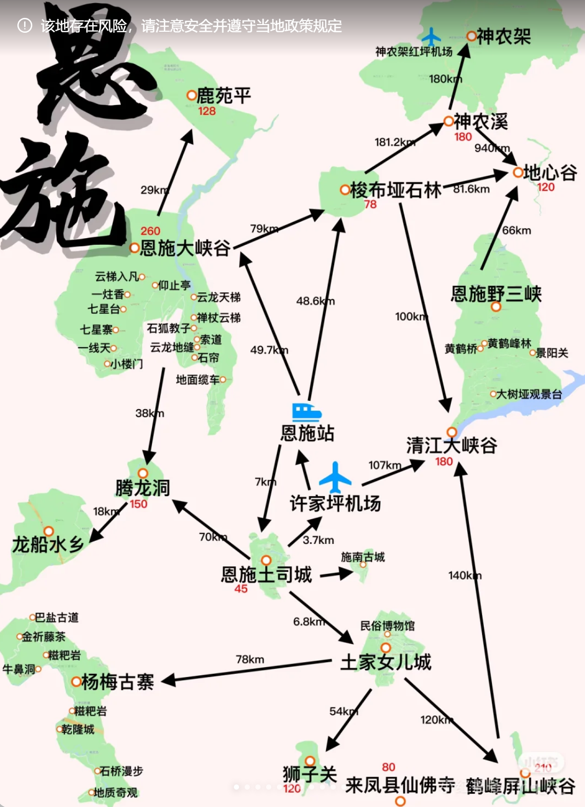
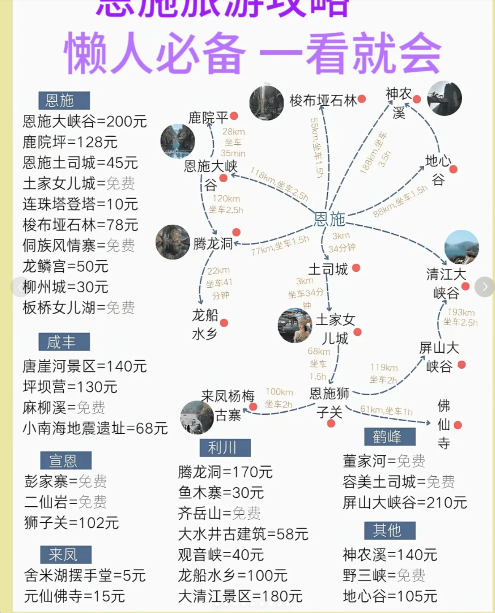
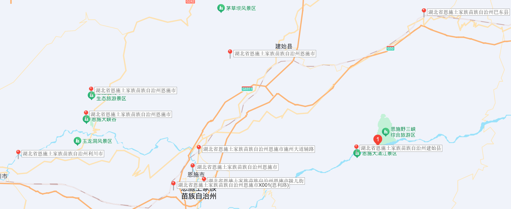

## 票价一览

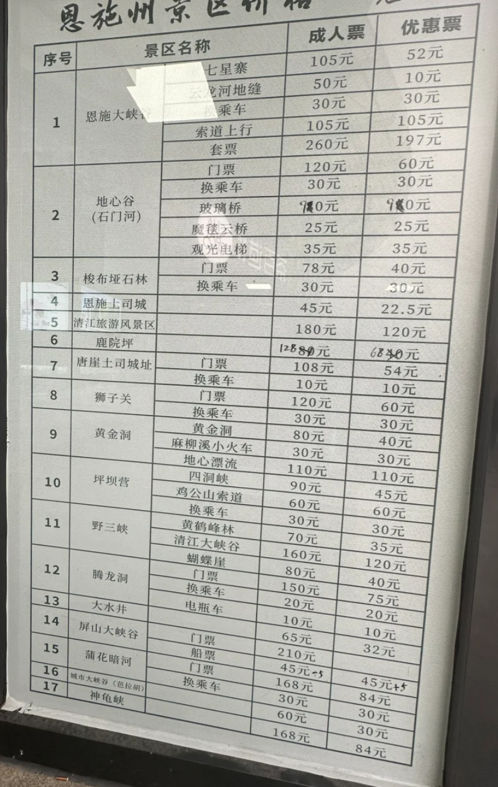